# Ahmad Rizal Khamdani — Portfolio

**Full Stack Developer** · 3+ years building web & mobile products · Malang, Indonesia

📧 ahmadkhamdani9@gmail.com · [GitHub](https://github.com/rizalord) · [LinkedIn](https://www.linkedin.com/in/rizalord)

---

## About

I'm a full stack developer with experience spanning frontend, backend, mobile, and even desktop applications. Over the past three years I've moved from building landing pages for competitions to shipping production systems for universities, SaaS products, and blockchain-based platforms — usually as the sole or lead engineer responsible for architecture, delivery, and maintenance.

Below are the projects I'm proudest of — the ones that stretched my skills the most, either in technical complexity, scope, or the responsibility I carried.

---

## Flowcian — AI Workflow Automation Agent

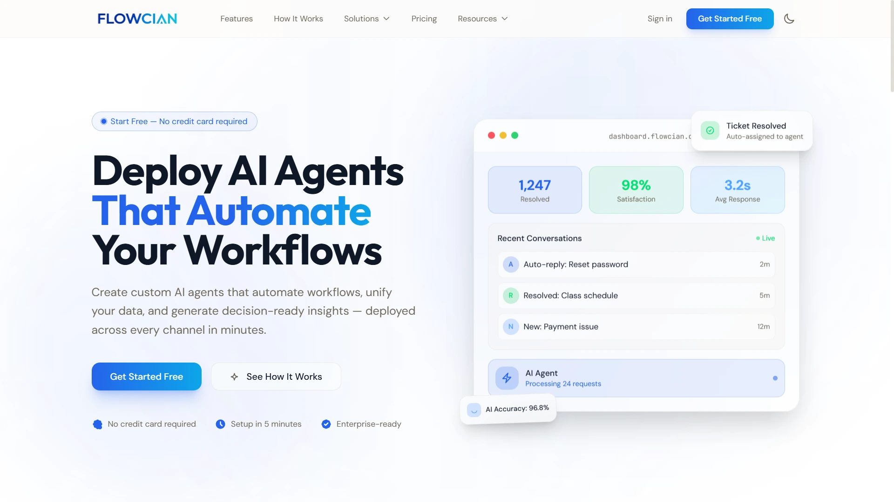

**flowcian.com** · AI Development

An AI agent platform that connects to a user's apps and services to automate workflows — think of it as a no-code automation builder powered by AI, similar in spirit to Zapier but with an AI agent deciding how to wire integrations together instead of manual rule-building.

This project pushed me into product territory beyond "just write the code": designing how an AI agent reasons about connecting third-party APIs, handling authentication across services, and making the automation builder approachable for non-technical users. It's one of my most recent and most ambitious builds — a real SaaS product rather than a client deliverable.

---

## BARTER — Decentralized Barter Trading App

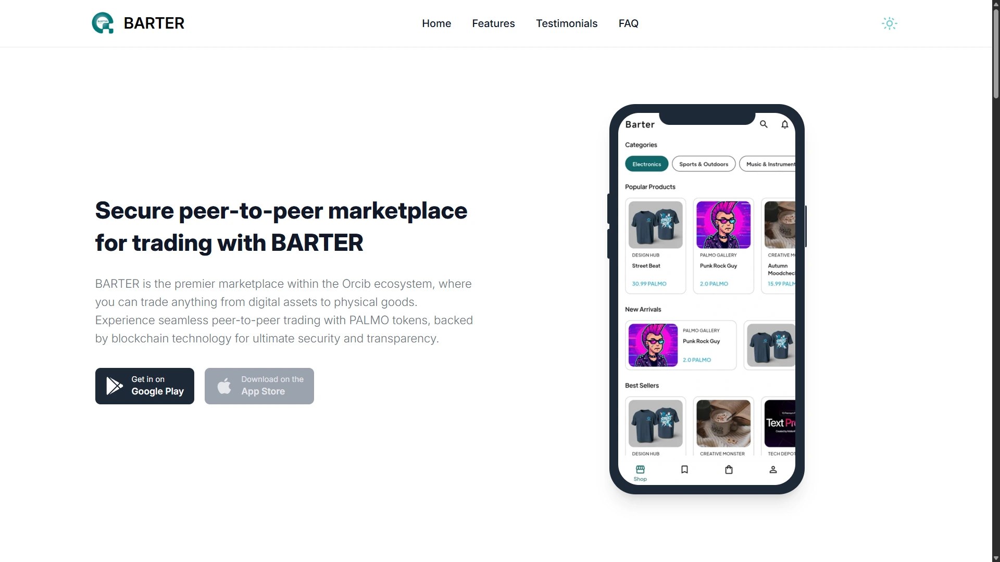

**barter.orcib.com** · Mobile Development · Solana Blockchain

A mobile application that lets people trade goods and services directly with each other — no money changing hands — built on the Solana blockchain to make exchanges trustless and verifiable.

Working with Solana meant getting hands-on with wallet integration, on-chain transaction logic, and the very different mental model blockchain development demands compared to a typical CRUD backend. Combining that with a mobile-first UX for a barter economy (matching offers, verifying trades, building trust between strangers) made this one of my more technically adventurous projects.

---

## PIPA — Community Token Exchange Platform

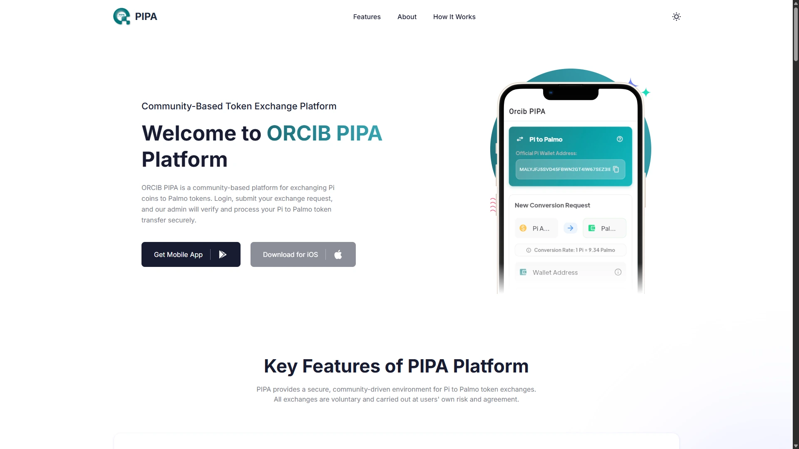

**pipa.orcib.com** · Mobile Development

A platform enabling users to trade between PI Token and PALMO Token, built to support a community-driven digital asset ecosystem. Like BARTER, this project required understanding token economics and building a mobile experience that makes exchanging digital assets feel safe and simple for a non-crypto-native audience.

---

## Gate SSO — University Single Sign-On System

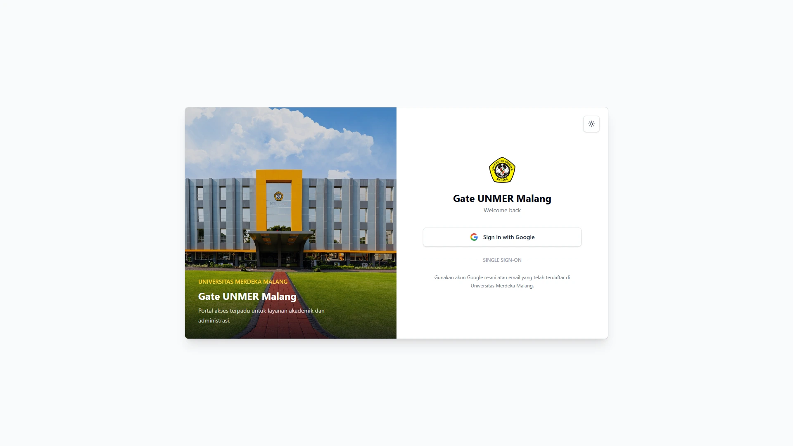

**gate.unmer.ac.id** · Web Development

A centralized Single Sign-On system for Universitas Merdeka Malang, letting students and staff authenticate once and access every connected university service — academic records, inventory, e-office, tracer study, and more.

Building an SSO isn't just "add a login page" — it's the trust root for an entire ecosystem of applications. Getting the session/token handling, security, and integration contracts right here directly affects every other system in the university's stack (including several others in this portfolio). It's the kind of infrastructure project where mistakes are expensive, which made it one of the most high-responsibility pieces of work I've taken on.

---

## University Information Systems — Universitas Merdeka Malang

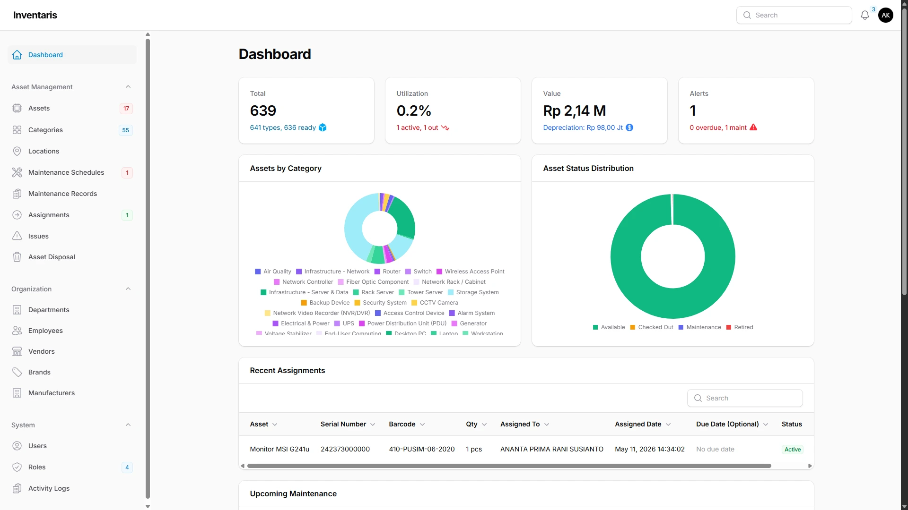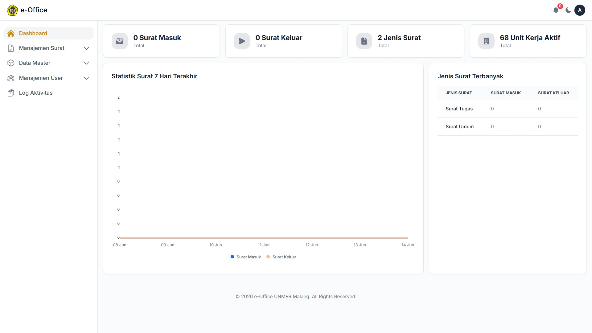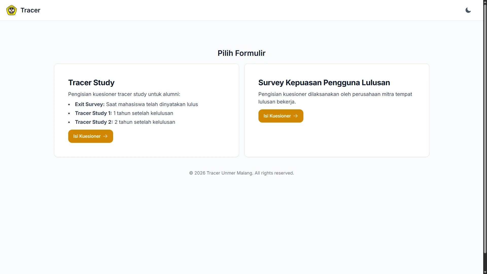

**Web Development** — as a contracted Programmer at Unmer (2025–present)

A suite of internal systems I've been building and maintaining for the university:

- **Inventaris** ([inventaris.unmer.ac.id](https://inventaris.unmer.ac.id)) — asset and inventory management for the whole institution.
- **E-Office** ([eoffice.unmer.ac.id](https://eoffice.unmer.ac.id)) — electronic office administration, replacing paper-based workflows for internal processes.
- **Tracer Study** ([tracer.unmer.ac.id](https://tracer.unmer.ac.id)) — tracks graduate career outcomes, a system universities in Indonesia are required to maintain for accreditation.

Rather than one-off freelance builds, this is an ongoing role where I own multiple interdependent systems (including Gate SSO above) used daily by real staff and students. It's taught me a lot about maintaining legacy-adjacent systems responsibly, prioritizing reliability over cleverness, and supporting non-technical users directly.

---

## ChatGPT Clone — Microservices AI Chat App

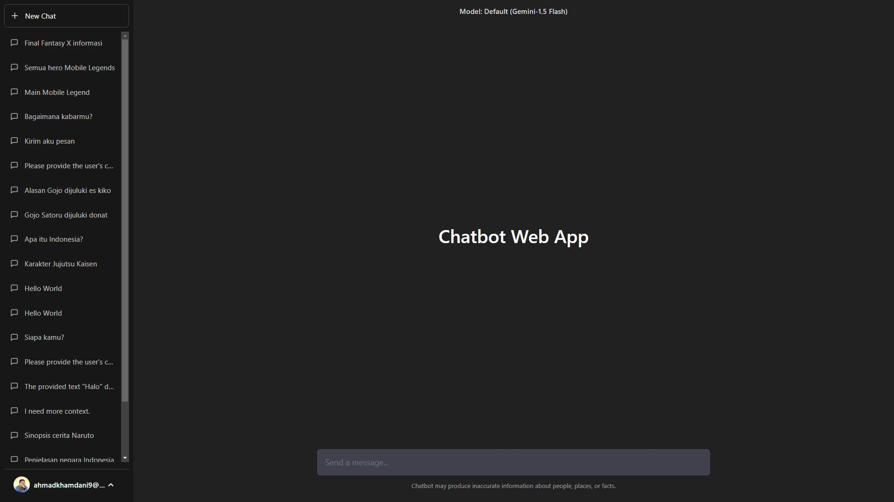

**chatbot-web-service.vercel.app** · Web Development · Next.js, Golang, PostgreSQL, gRPC, Gemini

A ChatGPT-style chat application built on Google's Gemini 1.5 Flash model, architected as microservices rather than a monolith — a Next.js frontend talking to Golang backend services over gRPC, backed by PostgreSQL.

I built this specifically to get real experience with a microservices architecture and gRPC service-to-service communication, both of which are common in larger engineering orgs but rarely come up in typical freelance/agency work. It's a good showcase of backend architecture skill, not just "call an LLM API."

---

## Zendo Driver — Driver Mobile App

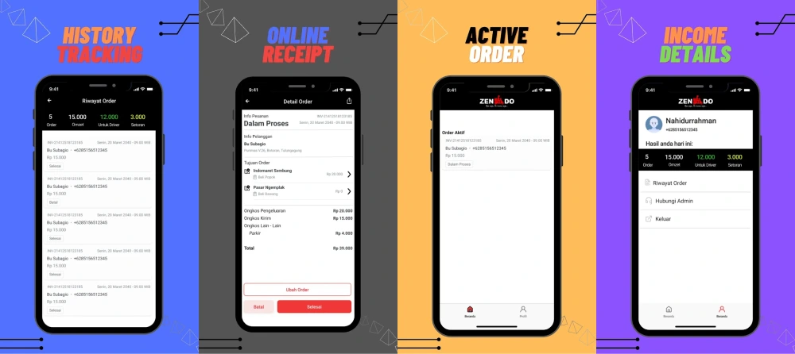

[Google Play](https://play.google.com/store/apps/details?id=com.zendo.driver&hl=en) · Mobile Development · Laravel, Flutter

A published, live-on-Play-Store mobile app for drivers working with the Zendo company, pairing a Flutter frontend with a Laravel backend. Beyond the usual CRUD-driven mobile app patterns, this project involved the realities of driver-facing logistics apps — real-time job/order handling, location-aware workflows, and backend reliability for people relying on the app to do their actual job.

Shipping to the Play Store also meant dealing with the full mobile release lifecycle: app signing, store listing requirements, and iterating post-launch based on real driver usage rather than just a demo build.

---

## Hub Arkatama — Fingerprint Attendance System

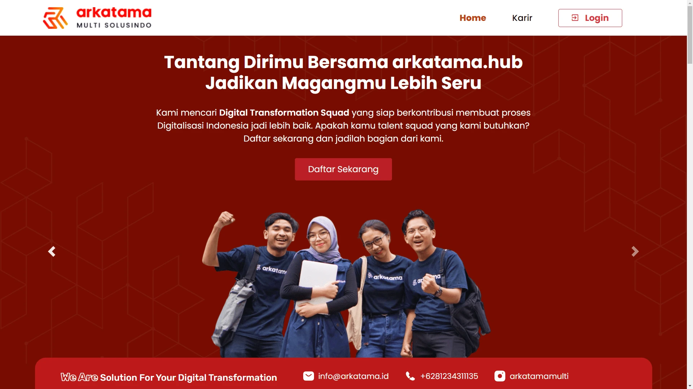

**hub.arkatama.id** · Web Development · Attendance System

An attendance system integrating with Fingerspot fingerprint hardware, built during my internship at PT. Arkatama Multi Solusindo. Integrating a web application with physical biometric devices — polling hardware, syncing attendance logs, reconciling data — was a different kind of complexity than pure web development: dealing with device SDKs and hardware reliability instead of just HTTP requests.

---

## Elebrary — Desktop Library Management System

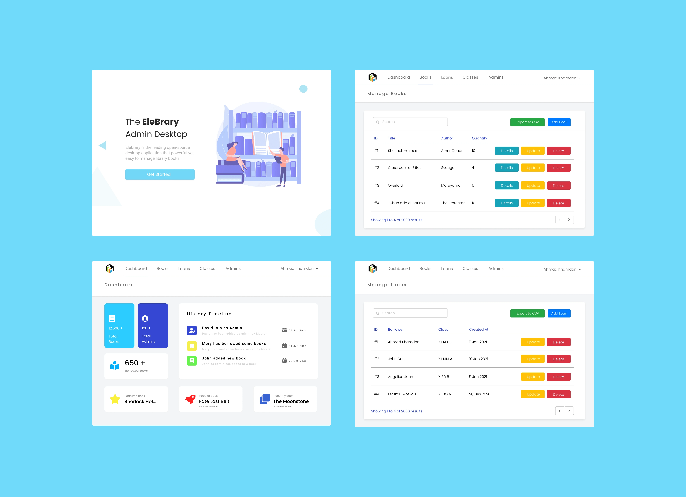

[github.com/rizalord/elebrary](https://github.com/rizalord/elebrary) · Desktop Development · VB.NET, SQL Server 2019

A full desktop application (not web) to manage a school library — cataloging, lending, and returns — built with VB.NET against SQL Server. This one stands out because it's outside my usual web/mobile lane: a complete offline-capable desktop app with its own UI toolkit constraints, local database design, and installer/deployment considerations, designed end-to-end from a Figma mockup through to a working system.

---

## Tech Stack Snapshot

Across these projects I've worked with:

- **Frontend:** React, Next.js, Vue, Tailwind CSS
- **Backend:** Golang, NestJS, Laravel
- **Mobile:** Flutter, React Native
- **Data:** PostgreSQL, MySQL, SQL Server, Redis
- **Infra/Messaging:** Docker, Kubernetes, Kafka, gRPC
- **Other:** Solana blockchain, VB.NET (desktop), AI integrations (Gemini, custom agents)

---

*This document highlights a curated subset of my work. See the list of all projects and contributions on my [GitHub](https://github.com/rizalord) and my portfolio website at [rizalord.com](https://rizalord.my.id).*
